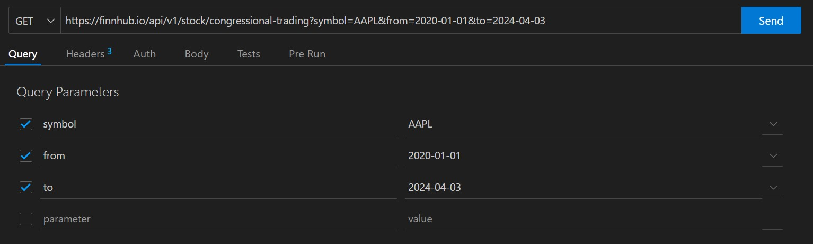

Converts the Json data pull from [FinnHub](https://finnhub.io/) into a CSV for analysis.

# Data Pull

If you use VS Code's Thunder Client extension, the setup looks like this:




# Conversion

Pseudo Code

1. Cleanup
2. Load all JSON files in _~/data_ folder.
3. For each file:
   1. Load the file as json
   2. do the default convert to csv
   3. save the file with the same name, but different extension.

```{r warning = F, message = F}
library(jsonlite)
library(tools)
library(dplyr)
library(stringr)
```

```{r}
rm(list = ls())

folder <- 'data'
files <- list.files(path = folder, pattern = "*.json$", full.names = T)

for(file_in in files) {
  file_out <- 
    file_in %>%
    file_path_sans_ext() %>%
    sprintf('%s.csv', .)
  data <-
    file_in %>%
    read_json() %>%
    .[['data']] %>%
    lapply(as.data.frame) %>%
    do.call(rbind, .) %>%
    mutate(across(where(is.character), str_trim)) %>%
    mutate(across(where(is.character), ~ ifelse(.x == '', NA, .x)))
  data %>%
    write.csv(
      file = file_out,
      row.names = F,
      na = '')
}
```